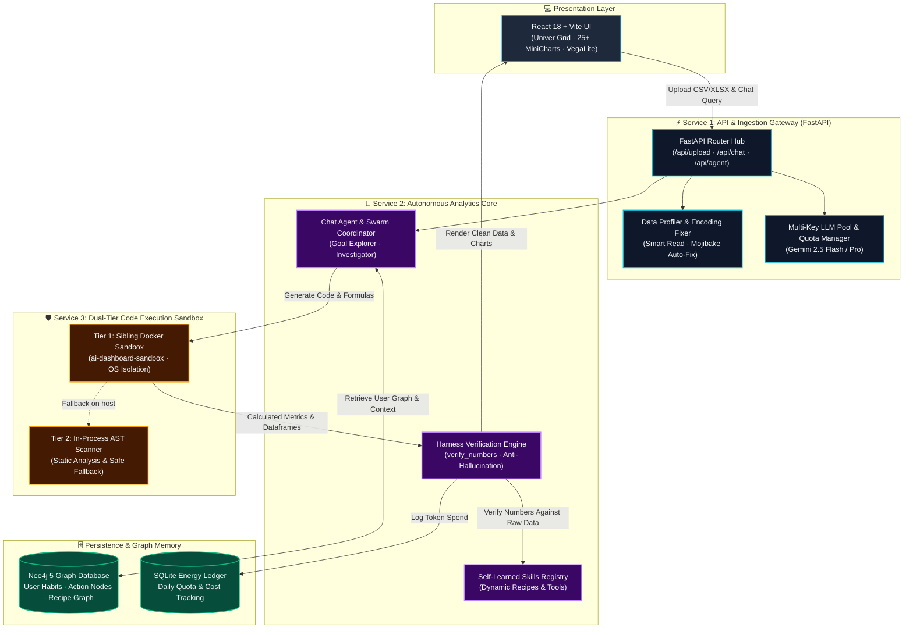
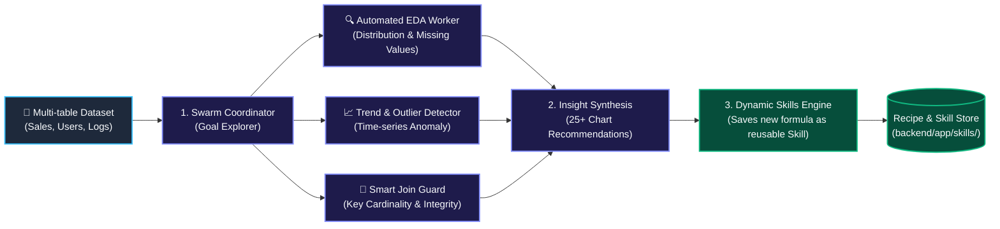
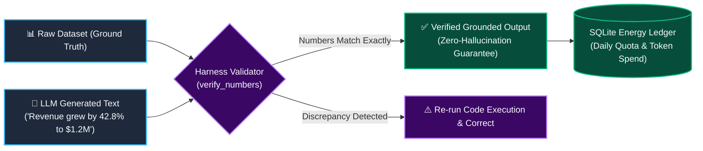

# 📊 GraphSheet: Autonomous AI Data Analyst & Interactive BI Engine

[](https://python.org)
[](https://fastapi.tiangolo.com)
[](https://react.dev)
[](https://typescriptlang.org)
[](https://neo4j.com)
[](https://pandas.pydata.org)
[](https://docker.com)

An enterprise-grade, **autonomous AI Data Analyst & Business Intelligence (BI) Platform** engineered with **FastAPI**, **React 18 (TypeScript)**, **Dual-Tier Docker Code Sandbox**, and **Neo4j Knowledge Graph Memory**. Features **Agent Swarm Exploratory Data Analysis (EDA)**, automated **Numerical Verification (Harness)** to eliminate LLM hallucinations, and an embedded **Univer Spreadsheet Canvas** supporting **25+ dynamic chart visualizations**.

---

## 🏛️ System Architecture & Engineering Flow

### 1. 🏗️ High-Level System Topology
Overview of the decoupled architecture between Interactive Frontend, API Gateway, Dual-Tier Code Sandbox, Neo4j Graph Memory, and Model Evaluation:



---

### 2. 🛡️ Dual-Tier Code Execution Sandbox & Security Gate
How dynamic Python/Pandas code is analyzed, isolated, and executed safely:

```mermaid
flowchart TD
    classDef input fill:#1e293b,stroke:#38bdf8,stroke-width:2px,color:#f8fafc;
    classDef gate fill:#3b0764,stroke:#c084fc,stroke-width:2px,color:#f8fafc;
    classDef tier1 fill:#064e3b,stroke:#10b981,stroke-width:2px,color:#f8fafc;
    classDef tier2 fill:#451a03,stroke:#f59e0b,stroke-width:2px,color:#f8fafc;
    classDef output fill:#0f172a,stroke:#22c55e,stroke-width:2px,color:#f8fafc;

    CODE["🐍 LLM-Generated Python Code
('df.groupby().agg()...')"]:::input --> SCAN["1. AST Static Analysis & Safety Scanner
(scan_code: Disallow eval, subprocess, os.system)"]:::gate
    
    SCAN -->|Passes AST Check| DOCKER_CHECK{"Docker Socket
Available?"}:::gate
    
    DOCKER_CHECK -->|Yes (Production)| TIER1["2. Tier 1: Sibling Docker Sandbox
(Spawns isolated container: ai-dashboard-sandbox)"]:::tier1
    TIER1 --> EXEC1["Run with CPU/RAM limits + 30s Timeout
Mount read-only dataset"]:::tier1
    
    DOCKER_CHECK -->|No / Local Dev| TIER2["3. Tier 2: In-Process Controlled Sandbox
(Scoped Globals + Restricted Builtins)"]:::tier2
    TIER2 --> EXEC2["Local Pandas Execution"]:::tier2
    
    EXEC1 --> RES["4. Output Result Extraction
(Dataframe JSON · Figures · Stats)"]:::output
    EXEC2 --> RES
```

---

### 3. 🐝 Agent Swarm & Autonomous Goal Explorer
Automated deep-dive analysis and dynamic skill acquisition pipeline:



---

### 4. 🎯 Harness Numerical Verifier & FinOps Energy Ledger
Preventing statistical hallucinations and controlling API spend:



---

## 🌟 Key Technical Highlights

### 1. 🛡️ Dual-Tier Container Sandbox Isolation (`agent/sandbox.py`)
- Executes arbitrary user/AI-generated Python data analysis code inside an isolated Docker container (`ai-dashboard-sandbox`) via `/var/run/docker.sock`.
- Enforces execution timeouts (30s), memory limits, and disallows network access from within the sandbox.
- Features an AST-based static analyzer (`scan_code`) that detects dangerous syscalls before execution.

### 2. 🕸️ Neo4j Knowledge Graph Memory (`memory/graph.py`)
- Models user identity, analysis history, data entity relationships, and calculation recipes as a connected graph.
- Context retrieval is performed via **Cypher Graph Traversals** rather than brute-force vector search, ensuring perfect structural recall of multi-table relationships.

### 3. 🎯 Harness Anti-Hallucination Engine (`ai/harness.py`)
- Audits every numerical claim generated in LLM responses against the ground-truth calculation from the Pandas runtime.
- Mismatches trigger automatic self-correction loops before results reach the user.

### 4. 📊 25+ Chart Types & Embedded Univer Spreadsheet Grid
- Integrates **Univer Spreadsheet Grid** (Excel-grade web sheets) for direct data editing and formula execution.
- Auto-generates **25+ chart types** (Bar, Line, Area, Heatmap, Scatter, Boxplot, Waterfall, Sankey, Radar, Treemap, Vega-Lite specs) with automatic encoding/mojibake repair (`encoding_fix.py`).

---

## 💡 Engineering Design Decisions & Trade-offs

| Architectural Decision | Chosen Strategy | Alternatives Considered | Rationale & Trade-off |
|---|---|---|---|
| **Code Execution Engine** | **Dual-Tier Docker Sandbox** | Bare subprocess, WebAssembly | Subprocess exposes the host to RCE vulnerabilities. WebAssembly lacks full Pandas/NumPy C-extension support. Docker provides native C-speed with OS-level isolation. |
| **Long-Term Context Store** | **Neo4j Graph Database** | Vector Store (Chroma/Pinecone) | Tabular analytics require relational and structural memory (foreign keys, habit nodes, recipe dependencies) which vector embeddings fail to capture accurately. |
| **Numerical Accuracy** | **Harness AST Number Matcher** | Relying on LLM reasoning | LLMs frequently make calculation errors on large floats. The Harness forces the LLM to write code, executes it in Pandas, and validates the text against actual execution values. |
| **Multi-Tenancy Key Pool** | **Atomic Key Rotation (`ai/pool.py`)** | Single API Key | Spreads token quotas across multiple Gemini API keys with automatic backoff and retry when hitting rate limits (`429 RESOURCE_EXHAUSTED`). |

---

## 📂 Monorepo Structure

```text
graphsheet-ai-analyst/
├── backend/                       # FastAPI Backend Service
│   ├── app/                       # Application Core
│   │   ├── agent/                 # Chat Agent, Code Interpreter, Dual-Tier Sandbox, Swarm
│   │   ├── ai/                    # Gemini Multi-Key Pool, Harness Verifier, Prompts
│   │   ├── data/                  # Smart Read, Encoding Fix, Relations, Trends, Join Guard
│   │   ├── memory/                # Neo4j Graph Memory & Background Sync Jobs
│   │   ├── routers/               # Endpoints (/api/upload, /api/chat, /api/agent)
│   │   ├── sheets/                # Google Sheets Client & Univer/Excel Export
│   │   └── skills/                # Curated & Self-Learned Analytics Skills
│   ├── Dockerfile                 # Backend Container
│   ├── Dockerfile.sandbox         # Isolated Execution Sandbox Container
│   ├── requirements.txt           # Python Dependencies
│   └── tests/                     # Automated Pytest Suite
├── frontend/                      # React 18 + Vite TypeScript Web UI
│   ├── src/
│   │   ├── chat/                  # Chat Workspace, MiniCharts (25 types), Univer Grid
│   │   └── api.ts                 # Central API Client
│   ├── Dockerfile                 # Multi-stage Nginx Production Image
│   ├── nginx.conf                 # SPA Routing Config
│   └── package.json               # Frontend Dependencies
├── model_eval/                    # Benchmark Evaluation Scripts & Model Registry
├── docs/                          # Architecture Specifications & Developer Guides
│   ├── BACKEND_MODULES_SPECIFICATION.md
│   ├── SYSTEM_SPECIFICATION_REPORT.md
│   └── AGENT_DEV_GUIDE.md
├── .env.example                   # Environment Variables Template
├── .gitignore                     # Build, Cache, Secrets Exclusions
├── docker-compose.yml             # 1-Click Orchestration (Backend + Neo4j + Frontend)
├── Makefile                       # Developer CLI Commands
└── LICENSE                        # MIT License
```

---

## 🚀 Quick Start Guide

### Prerequisites
- Docker & Docker Compose installed
- Google Gemini API Key(s)

### 1. Clone & Configure Environment
```bash
git clone https://github.com/cuongtt0201/graphsheet-ai-analyst.git
cd graphsheet-ai-analyst

# Copy environment template
cp .env.example .env
```
Edit `.env` and configure your API key(s):
```ini
GEMINI_API_KEYS=your_gemini_api_key_1,your_gemini_api_key_2
```

### 2. Build Sandbox Image & Launch Services
```bash
# Build the isolated code sandbox container image
make build-sandbox

# Start all microservices in background (Neo4j, Backend, Frontend)
make up
```

### 3. Open Interactive Web Workspace
Navigate to:
👉 **`http://localhost:5173`**

- **Upload Datasets:** Drag and drop `.xlsx`, `.csv`, `.json` files.
- **Natural Language Analytics:** Ask complex questions (*"Phân tích xu hướng doanh thu theo quý và tìm các giao dịch bất thường"*).
- **Interactive Spreadsheets:** Inspect generated formulas and edit data directly in Univer Grid.
- **Export Reports:** Download professional Excel sheets with charts.

---

## 🛠️ Developer CLI & Makefile Reference

```bash
make up              # Start all services (Neo4j, Backend, Frontend)
make down            # Stop all containers
make restart         # Hot-restart backend and frontend
make build-sandbox   # Build the Docker sandbox execution image
make logs            # Tail live container logs
make status          # Check container health and port mappings
make test            # Run backend pytest test suite
make clean           # Stop and wipe database volumes
```

---

## 📄 License
This project is licensed under the [MIT License](LICENSE).
