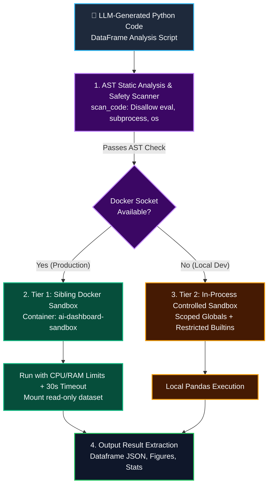
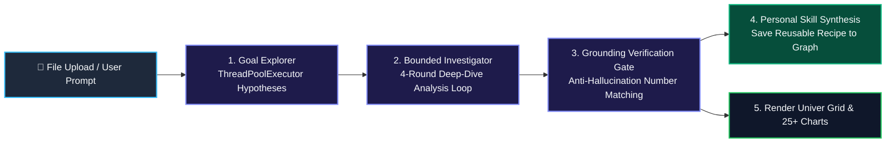

# 📊 GraphSheet: Autonomous AI Data Analyst & Full-Stack Interactive BI Platform

[](https://python.org)
[](https://fastapi.tiangolo.com)
[](https://react.dev)
[](https://typescriptlang.org)
[](https://neo4j.com)
[](https://sqlite.org)
[](https://univer.ai)
[](https://github.com/Kanaries/Graphic-Walker)
[](https://docker.com)

**GraphSheet** is a production-grade, full-stack **Autonomous AI Data Analyst and Business Intelligence (BI) Platform**. It combines an interactive React 19 web workspace (Univer Spreadsheet Grid + Tableau-like GraphicWalker + 25+ dynamic MiniCharts) with an advanced backend engine featuring **Dual-Tier Docker Code Execution Sandboxing**, **Neo4j Long-term Graph Memory**, a **Multi-Provider AI Routing Pool & SQLite Energy Ledger** (Gemini multi-key multiplexing + OpenRouter safety net), **Personalized Skill Synthesis**, and a **Deterministic Anti-Hallucination Verification Harness**.

---

## 🏛️ System Architecture & Engineering Flow

### 1. 🏗️ High-Level Microservices Topology

```mermaid
flowchart TD
    classDef client fill:#1e293b,stroke:#38bdf8,stroke-width:2px,color:#f8fafc;
    classDef gateway fill:#0f172a,stroke:#06b6d4,stroke-width:2px,color:#f8fafc;
    classDef agent fill:#3b0764,stroke:#c084fc,stroke-width:2px,color:#f8fafc;
    classDef sandbox fill:#451a03,stroke:#f59e0b,stroke-width:2px,color:#f8fafc;
    classDef memory fill:#064e3b,stroke:#10b981,stroke-width:2px,color:#f8fafc;
    classDef energy fill:#1e1b4b,stroke:#818cf8,stroke-width:2px,color:#f8fafc;
    classDef eval fill:#500724,stroke:#f43f5e,stroke-width:2px,color:#f8fafc;

    subgraph Presentation ["💻 Full-Stack Frontend (React 19 + TypeScript + Vite)"]
        FE_LANDING["Landing Screen & Dev Auth\n(Live Spreadsheet Cell Animation)"]:::client
        FE_WORKSPACE["Interactive Chat & BI Workspace\n(WorkBench 4-Stage Rail · Thought Stream)"]:::client
        FE_GRIDS["Data Grid & BI Canvases\n(Univer Sheets Grid · GraphicWalker Drag-and-Drop)"]:::client
        FE_CHARTS["Visualization Engine\n(25+ Native MiniCharts · VegaLite)"]:::client
        FE_ADMIN["Swarm Admin Dashboard\n(Real-Time SSE Agent Telemetry & Thought Pulse)"]:::client
    end

    subgraph Gateway ["⚡ API Gateway & Data Ingestion Pipeline (FastAPI)"]
        ROUTER["FastAPI Router Hub\n(/api/upload · /api/chat · /api/agent · /api/tables)"]:::gateway
        PROFILER["Data Profiler & Mojibake Auto-Fix\n(Smart Read · Charset Normalizer · Header Repair)"]:::gateway
        PARQUET["LazySessionState\n(Apache Parquet Serialization · OOM Defense)"]:::gateway
    end

    subgraph AIRouting ["🔋 LLM Energy Ledger & Dynamic Multi-Slot Router"]
        POOL["Multi-Slot Router Hub\n(Slot = Provider + Model + Key · Cooldown Memory)"]:::energy
        ROUTER_AFFINITY["Prompt-Cache Affinity\n(Affinity Bonus · Round-Robin Balancing)"]:::energy
        SAFETY["OpenRouter Safety Net\n(Automatic 429 Failover & Cost-Aware Penalty)"]:::energy
        LEDGER[("SQLite Energy Ledger (.energy.db)\nPriority Floors: Critical 100% · Normal 85% · Background 60%")]:::energy
    end

    subgraph AgentCore ["🤖 Multi-Agent Analytics Swarm & Verification Core"]
        ORCH["Chat Agent & Swarm Coordinator\n(Goal Explorer · Multi-Sheet DataAgent · DataGen)"]:::agent
        INVEST["Bounded Root-Cause Investigator\n(4-Round Loop: Breakdown / Outlier / Decompose)"]:::agent
        BABEL["BabelTele Schema Compression\n(Shorthand Notation: #, $, @, ∅, D, [...])"]:::agent
        HARNESS["Grounding Harness Engine\n(verify_numbers · Regex Ground Truth Gate)"]:::agent
    end

    subgraph Sandbox ["🛡️ Dual-Tier Code Execution Sandbox"]
        DOCKER_SB["Tier 1: Sibling Docker Sandbox (Production)\n(ai-dashboard-sandbox · Network Mode: None · IPC via Parquet)"]:::sandbox
        AST_SB["Tier 2: In-Process AST Scanner (Fallback)\n(Static Whitelist · Blocking Dunder/OS/Subprocess)"]:::sandbox
    end

    subgraph MemoryLayer ["🧠 Latent Graph Memory & Self-Evolving Skills"]
        SKILLS["Dual-Tier Skills Registry\n(Curated Global Skills vs Personal AI-Learned Skills)"]:::memory
        NEO[("Neo4j 5 Graph Memory\n:User · :Action · :File · :Recipe · :Behavior")]:::memory
        IDLE["Idle Distillation Worker\n(Asynchronous Background Habit & Preference Distillation)"]:::memory
    end

    subgraph ModelEval ["🧪 Offline Model Benchmark Framework (model_eval/)"]
        DISCOVER["Provider Discovery\n(discover.py)"]:::eval
        BENCH["Schema & Latency Evaluator\n(evaluate.py + test_cases.py)"]:::eval
        REGISTRY["models.json\n(Ranked Model Catalog)"]:::eval
    end

    FE_WORKSPACE <-->|NDJSON / SSE Events| ROUTER
    FE_ADMIN <-->|/api/agent/swarm-stream| ROUTER
    ROUTER --> PROFILER --> PARQUET
    ROUTER --> POOL
    POOL <--> LEDGER
    POOL --> ROUTER_AFFINITY
    POOL -.->|Fallback on Primary Depletion| SAFETY
    
    ROUTER --> ORCH
    ORCH <--> INVEST
    ORCH --> BABEL
    ORCH <-->|Load Personal & Curated Skills| SKILLS
    ORCH <-->|Retrieve User Graph & Recipes| NEO

    ORCH -->|Generate Pandas Analytics Code| DOCKER_SB
    DOCKER_SB -.->|Fallback on local dev| AST_SB
    DOCKER_SB -->|Calculated Metrics & Dataframes| HARNESS
    
    HARNESS -->|Ground Truth Verification| FE_CHARTS
    HARNESS -->|Auto-Learn New Validated Skill| SKILLS
    NEO <--> IDLE
    REGISTRY --> POOL
```



---

### 2. 🛡️ Dual-Tier Code Execution Sandbox & Security Gate



---

### 3. 🐝 Agent Swarm & Autonomous Goal Explorer



---

## 💎 Key System Capabilities Across the Full Stack

### 1. 💻 Presentation Layer & UI/UX (React 19 & TypeScript)
* **Univer Spreadsheet Grid (`@univerjs/presets`)**: Full-featured in-browser Excel-grade canvas allowing users to inspect raw data, modify cells, copy numbers, and execute native spreadsheet formulas.
* **GraphicWalker BI Explorer (`@kanaries/graphic-walker`)**: Seamless Tableau-like visual exploration embedded directly into the workspace for instant drag-and-drop dimensions, measures, and aggregations.
* **25+ Native MiniCharts & Vega-Lite**: Automated rendering of Bar, Multi-line, Area, Donut, Scatter, Heatmap, Waterfall, Funnel, Radar, and Treemap charts with auto-computed axes, compact Vietnamese currency formatting (`tỷ`, `tr`, `k`), and hover tooltips.
* **WorkBench Dynamic Waiting Rail (`WorkBench.tsx`)**:
  * **4-Stage Progress Rail**: `Đọc tệp` $\rightarrow$ `Hiểu cấu trúc` $\rightarrow$ `Phân tích` $\rightarrow$ `Dựng bảng`.
  * **Real-time Thought Stream**: Live arrival of the LLM's analytical hypotheses and inner reasoning.
  * **Engine Strip Telemetry**: Displays active model, provider, tokens in/out, execution time, and re-routing attempts in real time.
* **Swarm Admin Telemetry Dashboard (`SwarmMonitor.tsx`)**: Dedicated admin view subscribing to `/api/agent/swarm-stream` (Server-Sent Events) with live active pulse indicators and thought logs for `DataAgent`, `CodeAgent`, and `PoolRouter`.
* **Onboarding Guided Tour (`Tour.tsx`) & Landing Experience**: Interactive step-by-step walkthrough for first-time users and a high-aesthetic landing page with animated spreadsheet cell matrices.

---

### 2. 🔋 Multi-Provider AI Routing Pool & SQLite Energy Ledger (`app/ai/`)
* **Persistent SQLite Energy Ledger (`energy.py`)**:
  * Tracks non-healing quota axes across backend restarts using SQLite with Write-Ahead Logging (`WAL` mode).
  * Enforces **Daily Request Limits** (e.g., OpenRouter 50 req/day, Gemini daily free caps) and **Tokens-Per-Minute (TPM)** ceilings.
* **Priority-Class Quota Floors**:
  * `CRITICAL (1.00)`: Interactive user watching a UI spinner (100% budget accessible).
  * `NORMAL (0.85)`: Standard asynchronous pipeline tasks (throttled when 85% budget is spent).
  * `BACKGROUND (0.60)`: Idle memory distillation and warmup jobs (halted at 60% spend to guarantee 40% daily quota strictly reserved for human users).
* **Multi-Slot Multiplexing & Cooldown Memory (`pool.py`)**:
  * Aggregates multiple API keys into discrete slots `(provider, model, api_key)`.
  * Automatically parks slots encountering HTTP 429 under exponential cooldown and rotates requests across available slots.
* **Prompt-Cache Affinity**: Grants an `AFFINITY_BONUS = 5.0` to route consecutive requests from the same session to the same slot, hitting provider-side implicit prompt caches without creating hotspots.
* **OpenRouter Safety Net**: Operates with a `FALLBACK_PENALTY = 1000.0`, reaching OpenRouter only when primary Gemini slots are exhausted or cooling down.

---

### 3. 🧠 Self-Evolving Personal Skills & Neo4j Latent Memory (`app/agent/` & `app/memory/`)
* **Two-Tier Skill Architecture (`skills_manager.py`)**:
  * `skills/curated/`: Core analytical recipes shipped with the platform (Pareto 80/20, YoY growth, outlier z-score detection).
  * `skills/personal/{user_id}/`: **AI autonomously writes, validates, and registers Python functions** tailored to individual users (`save_new_skill`). Each user's sandbox is isolated so the AI evolves to match specific business domains.
* **Dual-Phase AST Security Gate**: Dynamic skills are scanned against an AST whitelist both at creation time and at load time to eliminate Remote Code Execution (RCE) vectors.
* **Neo4j Graph Schema**:
  ```
  (:User)-[:PERFORMED]->(:Action)-[:ON]->(:File)
  (:User)-[:BUILT]->(:Recipe)
  (:User)-[:HAS_SKILL]->(:Skill)
  (:User)-[:HAS_BEHAVIOR]->(:Behavior)
  (:File)-[:HAS_COLUMN]->(:Column)
  ```
* **Idle Behavior Distillation (`idle_job.py`)**: Asynchronous background worker activates when users go idle, distilling raw action logs into persistent `:Behavior` nodes and pruning ephemeral logs.

---

### 4. 🛡️ Dual-Tier Code Execution Sandbox (`app/agent/sandbox.py`)
* **Tier 1 (Production - Sibling Docker Container)**:
  * Connects to `/var/run/docker.sock` to spawn ephemeral `ai-dashboard-sandbox` containers.
  * Enforces `network_mode="none"`, read-only filesystems (except `/tmp`), 30s timeout, CPU/RAM quotas, and Parquet/JSON IPC (Pickle strictly banned).
* **Tier 2 (Fallback - In-Process AST Scanner)**:
  * Automatically activates if Docker daemon is unreachable.
  * Statically inspects AST against whitelisted libraries (`pandas`, `numpy`, `math`, `re`, `datetime`, `statsmodels`), blocking dunder methods (`__subclasses__`, `__globals__`), `eval`, and system modules (`subprocess`, `os`).

---

### 5. 🎯 Anti-Hallucination Grounding Harness (`app/ai/harness.py`)
* **Deterministic Number Verification (`verify_numbers`)**:
  * Gathers exact ground-truth numbers from executed Pandas sandbox dataframes and chart series.
  * Scans AI-written responses with a non-LLM regex gate; any ungrounded numeric claim triggers automated self-correction or truncation.
* **Task Batching (`batch_tasks`)**: Merges analytical insights, chart layout selection, and dynamic skill synthesis into a single structured JSON schema call, slashing latency by 60–70%.

---

### 6. 🕵️ Multi-Agent Swarm & Root-Cause Investigation (`app/agent/`)
* **Bounded Root-Cause Investigator (`investigator.py`)**: Executes a bounded loop (max 4 rounds) with discrete analytical moves (`breakdown`, `compare`, `outlier`, `composition`, `decompose`) for deep anomalies.
* **Proactive Goal Explorer (`goal_explorer.py`)**: Concurrently evaluates analytical hypotheses via `ThreadPoolExecutor` upon file upload to provide immediate starter insights.
* **DataAgent & DataGenAgent (`sub_agents.py`)**: Detects foreign-key relationships across multi-sheet workbooks to build automatic join plans, or synthesizes realistic mock data when users query without files.
* **Executive Report Generator (`report.py`)**: Summarizes complex multi-table analysis into a structured narrative: **Executive Summary $\rightarrow$ Key Findings $\rightarrow$ Anomalies $\rightarrow$ Recommendations**.

---

### 7. 📊 Data Ingestion, Profiling & Mojibake Auto-Repair (`app/data/`)
* **Vietnamese Mojibake & Encoding Repair (`encoding_fix.py`)**:
  * Autodetects non-UTF-8 character encodings (`cp1258`, `cp1252`, `latin-1`) via `charset_normalizer`.
  * Detects and fixes double-encoded UTF-8 mojibake (e.g., `á` $\rightarrow$ `á`, `Ä‘` $\rightarrow$ `đ`) based on C1 control character noise reduction.
* **Intelligent Header Detection & 2-Level Header Merging**: Automatically identifies header rows, strips trailing totals, and merges grouped headers (e.g., "SỐ HÓA ĐƠN" + "Đầu kỳ" $\rightarrow$ "SỐ HÓA ĐƠN - Đầu kỳ").
* **BabelTele Schema Notation (`babeltele.py`)**: Compresses dataset schemas using compact symbols (`#` numeric, `$` category, `@` date, `∅` null rate, `D` distinct count), saving 60–80% context window tokens.
* **LazySessionState (`app/state.py`)**: Serializes DataFrames to on-disk **Apache Parquet** files (`app/storage/{session_id}/dataframes/`) to completely prevent memory leaks and Out-of-Memory (OOM) crashes.

---

### 8. 🧪 Offline Model Benchmark Framework (`model_eval/`)
* **Automatic Discovery (`discover.py`)**: Dynamically queries provider endpoints to find all available models for configured keys.
* **Rigorous Validation (`evaluate.py` + `test_cases.py`)**: Benchmarks discovered models against representative system prompts (Join Plans, Dashboard Plans) to enforce strict JSON schema compliance and evaluate latency.
* **Dynamic Model Registry (`models.json`)**: Exports an ordered, validated catalog used directly by the backend runtime router.

---

## 📂 Repository Structure

```
graphsheet-ai-analyst/
├── backend/
│   ├── app/
│   │   ├── agent/                 # Swarm, sandbox, code interpreter, skills manager
│   │   │   ├── sandbox.py                 # Dual-tier execution sandbox (Docker + AST)
│   │   │   ├── code_interpreter.py        # Python code generation & self-correction loop
│   │   │   ├── skills_manager.py          # Curated & personal AI-learned skills
│   │   │   ├── investigator.py            # Bounded 4-round root-cause engine
│   │   │   ├── goal_explorer.py           # Concurrent proactive hypothesis explorer
│   │   │   ├── sub_agents.py              # DataAgent (FK joins) & DataGenAgent
│   │   │   ├── report.py                  # Executive narrative report generator
│   │   │   ├── babeltele.py               # Schema compression notation
│   │   │   └── chart_utils.py             # Deterministic chart decimators & caps
│   │   ├── ai/                    # LLM routing pool, energy ledger, grounding harness
│   │   │   ├── pool.py                    # Multi-slot router, cooldowns, OpenRouter safety net
│   │   │   ├── energy.py                  # SQLite Energy Ledger & priority floors
│   │   │   ├── harness.py                 # Anti-hallucination verification gate
│   │   │   └── prompts.py                 # Grounded system prompts & personas
│   │   ├── data/                  # Profiling, mojibake repair, semantic grain recognition
│   │   │   ├── encoding_fix.py            # Charset auto-detection & mojibake auto-repair
│   │   │   ├── semantics.py               # Grain determination & domain detection
│   │   │   ├── profiling.py               # Table inspection & quality warning flags
│   │   │   └── context.py                 # Unified shared data context builder
│   │   ├── memory/                # Neo4j graph database & idle distillation worker
│   │   │   ├── graph.py                   # Graph schema, node creation & Cypher queries
│   │   │   └── idle_job.py                # Asynchronous background distillation worker
│   │   ├── routers/               # FastAPI endpoints (/upload, /chat, /agent, /auth)
│   │   ├── sheets/                # Google Sheets integration & Excel export
│   │   ├── main.py                # FastAPI application entrypoint & middleware
│   │   ├── state.py               # LazySessionState with Apache Parquet storage
│   │   └── config.py              # Global settings & environment loader
│   ├── Dockerfile                 # Backend container definition
│   ├── Dockerfile.sandbox         # Isolated Tier 1 sandbox container
│   └── requirements.txt           # Python dependencies
├── frontend/
│   ├── src/
│   │   ├── admin/                 # SwarmMonitor telemetry dashboard (SSE stream)
│   │   ├── chat/                  # ChatWorkspace, UniverGrid, BIExplore, MiniChart, VegaChart, WorkBench
│   │   ├── api.ts                 # Typed API client, SSE streaming hooks & models
│   │   ├── App.tsx                # Main routing & state coordinator
│   │   └── index.css              # Design tokens, variables & dark/light palettes
│   ├── package.json               # React 19, Univer, GraphicWalker, Vite dependencies
│   └── vite.config.ts
├── model_eval/                    # Offline evaluation framework for candidate LLMs
│   ├── discover.py                # Discovers accessible models for active keys
│   ├── evaluate.py                # Runs schema compliance & latency benchmarks
│   ├── test_cases.py              # Test cases (JoinPlan, DashboardPlan)
│   └── models.json                # Filtered, verified model catalog for runtime
├── docker-compose.yml             # Multi-service stack (Backend, Neo4j, Frontend, Cloudflared)
└── README.md
```

---

## 🚀 Quick Start & Deployment

### Prerequisites
* **Docker & Docker Compose** (Docker Desktop on Windows/macOS or Docker Engine on Linux)
* **Python 3.11+** & **Node.js 20+** (if running bare-metal)

### 1. Configure Environment Variables
Create the environment configuration file:

```bash
cp backend/.env.example backend/.env
```

Edit `backend/.env`:
```ini
# Gemini API Key Pool (comma-separated for multi-slot multiplexing)
GEMINI_API_KEYS=AIzaSyA...,AIzaSyB...

# OpenRouter Fallback Safety Net (Optional but recommended)
OPENROUTER_API_KEY=sk-or-v1-...
OPENROUTER_DAILY_CAP=50

# Neo4j Graph Memory (Optional - gracefully degrades to no-op if offline)
NEO4J_URI=bolt://neo4j:7687
NEO4J_USER=neo4j
NEO4J_PASSWORD=your_secure_password

# Session Security
SESSION_SECRET=generate_a_secure_random_key
```

### 2. Build the Tier 1 Sandbox Image
Build the isolated execution container image:
```bash
docker build -f backend/Dockerfile.sandbox -t ai-dashboard-sandbox backend/
```

### 3. Launch the Stack with Docker Compose
Start all microservices (FastAPI Backend, Neo4j 5 Graph DB, React Frontend, and Cloudflare Tunnel):
```bash
docker compose up --build -d
```

* **Interactive Web App**: `http://localhost:5173`
* **API Swagger Documentation**: `http://localhost:8000/docs`
* **Swarm Admin Telemetry**: `http://localhost:5173` (Navigated to Swarm Monitor)
* **Health Check**: `http://localhost:8000/health`

---

## 🧪 Testing & Quality Assurance

Run the comprehensive test suite verifying sandbox isolation, energy ledger priorities, dynamic slot routing, and anti-hallucination verification gates:

```bash
cd backend
pytest tests/ -v
```

---

## 📄 License

This project is licensed under the **MIT License** — see the [LICENSE](LICENSE) file for details.
