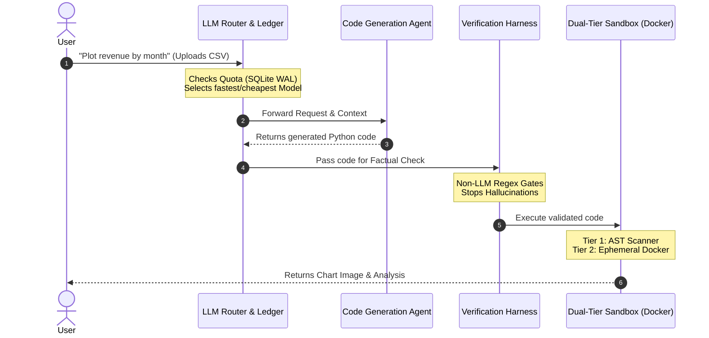

<div align="center">
  <h1>🚀 GraphSheet AI Analyst</h1>
  <p><strong>The Production-Grade AI Agent for Data Analysis</strong></p>
  <p>
    <em>Stop wrestling with raw data. Let the AI write the code, run it securely, and give you the answers.</em>
  </p>
</div>

---

## 🎯 What is this? (In 10 Seconds)

**👥 For Users:** 
It's like having a Senior Data Analyst built into your browser. You upload a spreadsheet (CSV/Excel) and ask, *"What's the revenue trend this quarter?"* The AI automatically writes the Python code, runs it, and hands you back a beautiful chart and summary.

**💻 For Engineers:** 
It is a resilient, full-stack Multi-Agent framework. It doesn't just call the OpenAI API; it tackles the hardest problems in AI engineering: **Code Execution Security**, **API Rate-Limiting**, **Context Window Optimization**, and **Hallucination Prevention**.

---

## ✨ The "Wow" Features

*   🧠 **Autonomous Execution:** You prompt. It writes Pandas/Matplotlib code. It executes. You get results.
*   🛡️ **Bulletproof Sandbox:** AI-generated code is inherently untrusted. We run it through a **Dual-Tier Sandbox** (AST Static Analysis + Disposable Docker Container) so a rogue LLM can never crash the host server.
*   💸 **LLM Routing & Energy Ledger:** API down? The **Router** auto-switches to a backup model. Running out of budget? The blazing-fast SQLite `WAL` **Energy Ledger** tracks token usage in real-time, cutting off requests before they drain your wallet.
*   🧹 **Auto-Healing Context:** The pipeline automatically repairs corrupted text (Mojibake) and compresses massive database schemas using BabelTele, saving thousands of tokens per request.

---

## 📐 How the Magic Happens (Architecture)



---

## ⚔️ The 4 Production Battles (Engineer's Case Study)

Building a wrapper around ChatGPT is easy. Building a *reliable, production-ready* AI system is a bloodbath. Here is how we survived:

### 1. The Reliability Battle (LLM Routing & Cost)
*   **The Problem:** LLM APIs are flaky (rate limits, 502 errors). Plus, token costs can spiral out of control.
*   **The Solution:** Implemented a resilient **Pool Router** (via OpenRouter/Local fallbacks). To control costs, an **Energy Ledger** built on SQLite in `WAL` mode acts as an ultra-fast, concurrent quota tracker. Every request "spends" energy; no energy = no execution.

### 2. The Security Battle (Dual-Tier Sandbox)
*   **The Problem:** Giving an AI the ability to run `exec()` is terrifying. It could write infinite loops or malicious `os.system()` calls.
*   **The Solution:** A defense-in-depth approach. 
    1.  **Tier 1 (AST Scanner):** Parses the Abstract Syntax Tree of the AI's code to statically block forbidden modules (`os`, `sys`, `subprocess`).
    2.  **Tier 2 (Sibling Docker):** The code runs inside an ephemeral, network-isolated `ai-dashboard-sandbox` container with strict memory/CPU limits and a 5-second timeout.

### 3. The Hallucination Battle (Verification Harness)
*   **The Problem:** LLMs are notorious for "smooth-talking" and hallucinating numbers when generating reports.
*   **The Solution:** The **Verification Harness**. Before returning any final output, deterministic (non-LLM) validators (like `verify_numbers`) double-check the AI's math against the raw data execution outputs. If it fails, the agent is forced to retry.

### 4. The Context Battle (Data Ops & Token Optimization)
*   **The Problem:** Dumping a 10,000-row CSV or a massive SQL schema into a prompt will blow up the Context Window and cost a fortune.
*   **The Solution:** Implemented a preprocessing pipeline that cleans encoding errors (Mojibake) and uses compression techniques (BabelTele logic) to condense table structures into tight metadata. The LLM gets the "map" of the data, not the payload.

---

## 🚀 Quickstart (Try it out)

Want to see it in action? Spin it up locally in 3 commands.

### Prerequisites
*   Docker & Docker Compose
*   Node.js (for Frontend dev)
*   Python 3.10+ (for Backend dev)

### Booting the System

```bash
# 1. Clone the repository
git clone https://github.com/cuongtt0201/graphsheet-ai-analyst.git
cd graphsheet-ai-analyst

# 2. Set up your environment variables
cp .env.example .env
# Edit .env to add your OPENROUTER_API_KEY or local LLM keys

# 3. Fire it up!
docker-compose up -d --build
```

**Access the application at:** `http://localhost:5173`

---
*Built with ❤️ for the future of data analytics.*
