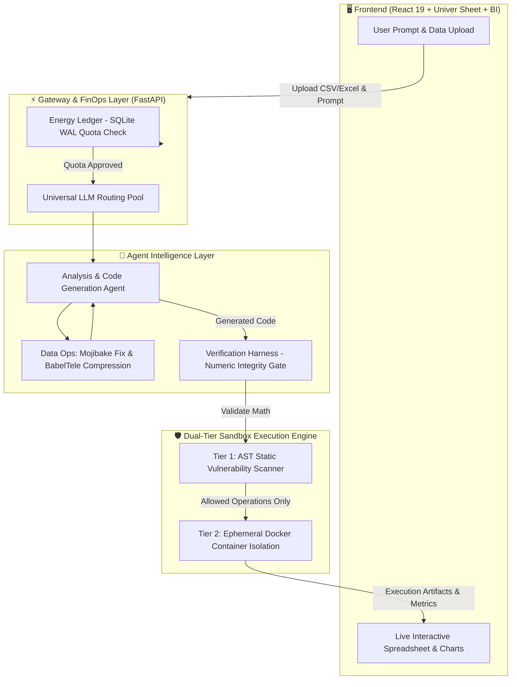

<p align="center">
  <h1 align="center">📊 GraphSheet AI Analyst</h1>
  <p align="center">
    <strong>Open-Source, Enterprise-Grade Multi-Agent Data Analyst & Sandboxed Code Execution Platform</strong>
  </p>
  <p align="center">
    <em>Turn natural language queries into verified Python analytics, interactive spreadsheets, and production charts — with zero hallucinations and ironclad security.</em>
  </p>
  <p align="center">
    <a href="https://github.com/cuongtt0201/graphsheet-ai-analyst"></a>
    <a href="https://github.com/cuongtt0201/graphsheet-ai-analyst"></a>
    <a href="https://github.com/cuongtt0201/graphsheet-ai-analyst"></a>
    <a href="https://github.com/cuongtt0201/graphsheet-ai-analyst"></a>
    <a href="https://github.com/cuongtt0201/graphsheet-ai-analyst"></a>
    <a href="https://github.com/cuongtt0201/graphsheet-ai-analyst"></a>
  </p>
</p>

---

## 🌟 What is GraphSheet AI?

**GraphSheet AI Analyst** is a self-hosted, full-stack AI analytics engine engineered for teams that require **absolute data safety, multi-model cost resilience, and verified numeric accuracy**.

Unlike ordinary AI chatbot wrappers that simply stream text, GraphSheet AI acts as an **autonomous data engineer**: it ingests raw spreadsheets, writes and inspects Python analysis code, runs it inside a secure isolated sandbox, verifies the calculations with deterministic check gates, and renders interactive spreadsheets and visualization dashboards in real-time.

---

## ⚡ Highlights & Key Capabilities

| Capability | Description | Why It Matters |
| :--- | :--- | :--- |
| 🛡️ **Dual-Tier Container Sandbox** | Static AST AST syntax inspection + Ephemeral Sibling Docker isolation. | Runs untrusted LLM-generated code safely without risking host server compromises or infinite loops. |
| 🔀 **Resilient LLM Routing Pool** | Dynamic failover across OpenRouter, DeepSeek, OpenAI, Anthropic, and local models. | 99.9% uptime for AI operations with instant fallback during provider outages or rate limits. |
| ⚡ **Real-Time Energy & FinOps Ledger** | SQLite `WAL`-backed ledger tracking micro-quotas per tenant/request. | Zero billing surprises; enforce hard token budgets and cost policies across your organization. |
| 🎯 **Anti-Hallucination Verification** | Deterministic non-LLM calculation check harness (`verify_numbers`). | Eliminates fake metrics; verifies that AI claims match actual code output before showing to users. |
| 🧹 **Automated Data Ops & Compression** | Native Mojibake text repair + BabelTele schema condenser. | Maximizes LLM context efficiency, saving up to 40% on token overhead while maintaining raw data accuracy. |
| 📊 **Interactive Spreadsheet Workbench** | Integrated Univer spreadsheet canvas + real-time dynamic mini-charts. | Seamlessly inspect, edit, and explore formula-level data right alongside AI chat insights. |

---

## 🏗️ System Architecture

GraphSheet AI separates orchestration, safety enforcement, and execution into decoupled, fault-tolerant layers:



---

## 🚀 1-Minute Quick Start

Get GraphSheet AI running locally with Docker Compose in just a few commands:

### 1. Clone the Repository
```bash
git clone https://github.com/cuongtt0201/graphsheet-ai-analyst.git
cd graphsheet-ai-analyst
```

### 2. Configure Environment
```bash
cp .env.example .env
# Open .env and configure your LLM Provider keys (e.g., OPENROUTER_API_KEY)
```

### 3. Launch Services
```bash
docker-compose up -d --build
```

Access the web portal at: **`http://localhost:5173`**  
API Documentation available at: **`http://localhost:8000/docs`**

---

## 💻 Tech Stack

### 🚀 Backend & Core Engine
- **FastAPI**: Asynchronous high-performance REST API.
- **Docker Engine API**: Ephemeral sibling container isolation for untrusted code execution.
- **SQLite (WAL Mode)**: Ultra-fast, zero-overhead concurrent FinOps ledger.
- **Pandas / NumPy / Matplotlib**: High-throughput statistical computing engine.

### 🎨 Modern Frontend
- **React 19 & Vite**: Ultra-fast, reactive component architecture.
- **Univer Spreadsheet**: Enterprise-grade in-browser spreadsheet canvas.
- **Tailwind CSS & Lucide Icons**: Modern, responsive analytics workspace.

---

## 🛡️ Enterprise Security & Sandboxing

GraphSheet AI implements **Defense-in-Depth** for running AI-generated Python code:

1. **Static Analysis (AST Inspection):** Prior to execution, code is parsed into an Abstract Syntax Tree to identify and reject forbidden modules (`os`, `sys`, `subprocess`, socket operations).
2. **Ephemeral Containerization:** Code executes in a short-lived, unprivileged container with strict limits:
   - 🚫 Zero network access (isolated bridge)
   - ⏱️ Hard timeout (max 5s execution limit)
   - 💾 Capped memory & CPU quotas

---

## 📄 License & Attribution

Distributed under the **MIT License**. See `LICENSE` for more information.

---

<p align="center">
  <sub>Crafted with passion for reliable, secure, and production-grade AI systems.</sub>
</p>
