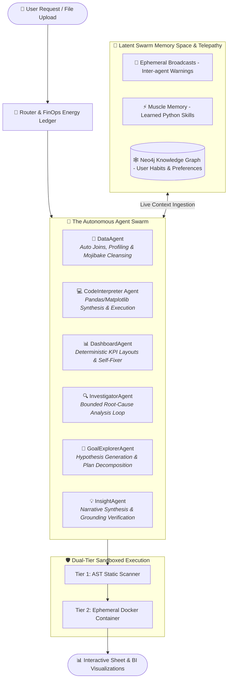

<p align="center">
  <h1 align="center">📊 GraphSheet AI Analyst</h1>
  <p align="center">
    <strong>Open-Source, Enterprise-Grade Multi-Agent Swarm & Sandboxed Data Analytics Platform</strong>
  </p>
  <p align="center">
    <em>Turn natural language queries into verified Python analytics, interactive spreadsheets, and production charts with an autonomous, self-learning Multi-Agent Swarm.</em>
  </p>
  <p align="center">
    <a href="https://github.com/cuongtt0201/graphsheet-ai-analyst"></a>
    <a href="https://github.com/cuongtt0201/graphsheet-ai-analyst"></a>
    <a href="https://github.com/cuongtt0201/graphsheet-ai-analyst"></a>
    <a href="https://github.com/cuongtt0201/graphsheet-ai-analyst"></a>
    <a href="https://github.com/cuongtt0201/graphsheet-ai-analyst"></a>
    <a href="https://github.com/cuongtt0201/graphsheet-ai-analyst"></a>
    <a href="https://github.com/cuongtt0201/graphsheet-ai-analyst"></a>
    <a href="https://github.com/cuongtt0201/graphsheet-ai-analyst"></a>
  </p>
</p>

---

## 🌟 What is GraphSheet AI?

**GraphSheet AI Analyst** is a self-hosted, full-stack **Multi-Agent Swarm** engineered for enterprise teams requiring **absolute data security, continuous self-learning, multi-model cost resilience, and verified numeric accuracy**.

Unlike simple single-prompt chatbot wrappers, GraphSheet AI coordinates a **specialized swarm of autonomous agents**: they collaborate via a shared latent memory hub, write and inspect Python analysis code, execute safely inside dual-tier container sandboxes, self-correct errors, verify calculations via deterministic gates, and synthesize interactive spreadsheets and visualization dashboards in real-time.

---

## 🐝 Multi-Agent Swarm Intelligence & Collaborative Memory

GraphSheet AI orchestrates a swarm of specialized sub-agents that communicate telepathically through a unified **Swarm Context Hub**:



### 🤖 Specialized Swarm Roles

| Agent | Responsibility | Key Superpower |
| :--- | :--- | :--- |
| 🧹 **DataAgent** | Automated data ingestion, table joins, and profiling. | Auto-detects table relationships, fixes Mojibake corruption, and flags non-additive columns to prevent calculation inflation. |
| 💻 **CodeInterpreter** | Python script synthesis and computation. | Directly utilizes learned "Muscle Memory" functions in sandbox memory for instant, zero-shot code execution. |
| 📊 **DashboardAgent** | KPI grid and multi-chart orchestration. | Employs an automated **Self-Fixer Loop** that catches schema mismatch errors and recovers without crashing. |
| 🔍 **InvestigatorAgent** | Autonomous deep-dive and root-cause analysis. | Operates a **Bounded Investigation Loop** executing analytical moves (`breakdown`, `compare`, `outlier`, `composition`, `decompose`) without open-ended agent wandering. |
| 🎯 **GoalExplorer** | High-level goal and strategic hypothesis decomposition. | Breaks ambiguous executive questions into structured, executable analytical milestones. |
| 💡 **InsightAgent** | Executive business summary generation. | Guarded by a deterministic **Anti-Hallucination Harness** (`verify_numbers`) that drops ungrounded statements. |

### 🧠 Swarm Memory & Continuous Skill Learning
* **Ephemeral Broadcasts (Swarm Telepathy):** Agents broadcast live runtime insights to each other (e.g., DataAgent warning CodeAgent: *"Column 'Revenue' is non-additive due to 1-to-N join; use Weighted Average instead"*).
* **Muscle Memory (Self-Created Skills):** When an agent devises an effective data transformation, it registers it as a reusable Python skill in execution memory. Subsequent prompts call these skills directly.
* **Semantic Knowledge Graph (Neo4j):** Persists user domain preferences, reporting habits, and company metrics across sessions for hyper-personalized analysis.

---

## ⚡ Highlights & Key Capabilities

| Capability | Description | Why It Matters |
| :--- | :--- | :--- |
| 🐝 **Collaborative Swarm Telepathy** | Shared context space with live inter-agent broadcasts. | Eliminates data misunderstandings between cleaning, code generation, and visualization phases. |
| 🛡️ **Dual-Tier Container Sandbox** | Static AST syntax inspection + Ephemeral Sibling Docker isolation. | Runs untrusted LLM-generated code safely without risking host server compromises or infinite loops. |
| 🔀 **Resilient LLM Routing Pool** | Dynamic failover across OpenRouter, DeepSeek, OpenAI, Anthropic, and local models. | 99.9% uptime for AI operations with instant fallback during provider outages or rate limits. |
| ⚡ **Real-Time Energy & FinOps Ledger** | SQLite `WAL`-backed ledger tracking micro-quotas per tenant/request. | Zero billing surprises; enforce hard token budgets and cost policies across your organization. |
| 🎯 **Anti-Hallucination Verification** | Deterministic non-LLM calculation check harness (`verify_numbers`). | Eliminates fake metrics; verifies that AI claims match actual code output before showing to users. |
| 🧹 **Automated Data Ops & Compression** | Native Mojibake text repair + BabelTele schema condenser. | Maximizes LLM context efficiency, saving up to 40% on token overhead while maintaining raw data accuracy. |
| 📊 **Interactive Spreadsheet Workbench** | Integrated Univer spreadsheet canvas + real-time dynamic mini-charts. | Seamlessly inspect, edit, and explore formula-level data right alongside AI chat insights. |

---

## 🚀 1-Minute Quick Start

Get GraphSheet AI running locally with Docker Compose in just a few commands:

### 1. Clone the Repository
```bash
git clone https://github.com/cuongtt0201/graphsheet-ai-analyst.git
cd graphsheet-ai-analyst
```

### 2. Configure Environment
```bash
cp .env.example .env
# Open .env and configure your LLM Provider keys (e.g., OPENROUTER_API_KEY)
```

### 3. Launch Services
```bash
docker-compose up -d --build
```

Access the web portal at: **`http://localhost:5173`**  
API Documentation available at: **`http://localhost:8000/docs`**

---

## 💻 Tech Stack

### 🚀 Backend & Swarm Engine
- **FastAPI**: Asynchronous high-performance REST API.
- **Docker Engine API**: Ephemeral sibling container isolation for untrusted code execution.
- **SQLite (WAL Mode)**: Ultra-fast, zero-overhead concurrent FinOps ledger.
- **Neo4j Graph Database**: Semantic memory, user preferences, and skill catalog.
- **Pandas / NumPy / Matplotlib**: High-throughput statistical computing engine.

### 🎨 Modern Frontend
- **React 19 & Vite**: Ultra-fast, reactive component architecture.
- **Univer Spreadsheet**: Enterprise-grade in-browser spreadsheet canvas.
- **Tailwind CSS & Lucide Icons**: Modern, responsive analytics workspace.

---

## 🛡️ Enterprise Security & Sandboxing

GraphSheet AI implements **Defense-in-Depth** for running AI-generated Python code:

1. **Static Analysis (AST Inspection):** Prior to execution, code is parsed into an Abstract Syntax Tree to identify and reject forbidden modules (`os`, `sys`, `subprocess`, socket operations).
2. **Ephemeral Containerization:** Code executes in a short-lived, unprivileged container with strict limits:
   - 🚫 Zero network access (isolated bridge)
   - ⏱️ Hard timeout (max 5s execution limit)
   - 💾 Capped memory & CPU quotas

---

## 📄 License & Attribution

Distributed under the **MIT License**. See `LICENSE` for more information.

---

<p align="center">
  <sub>Crafted with passion for reliable, secure, and production-grade Multi-Agent AI systems.</sub>
</p>
