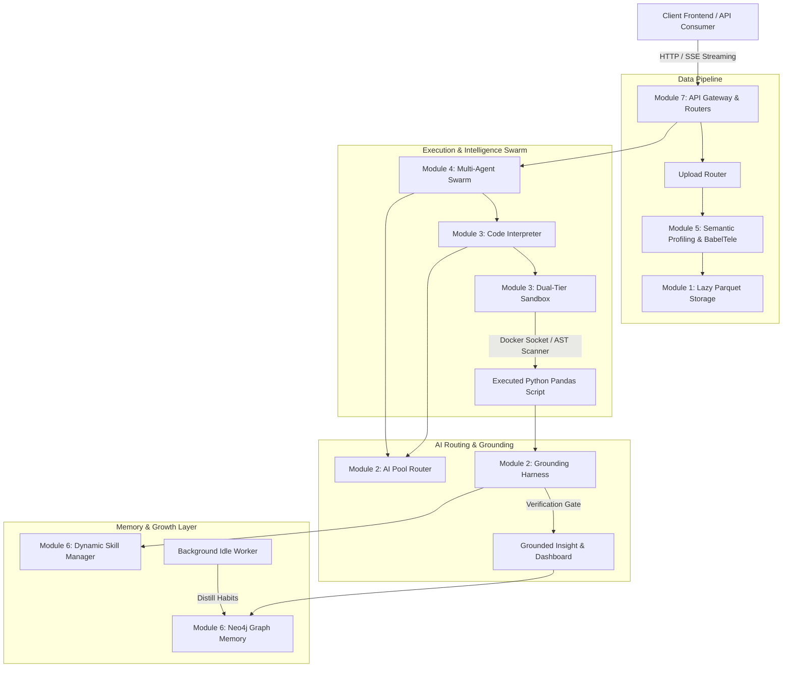
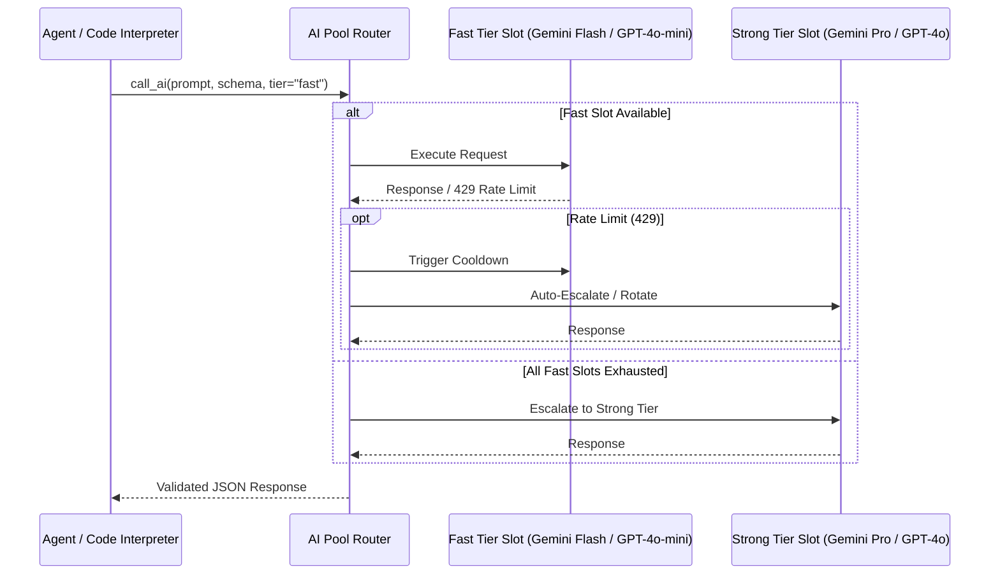
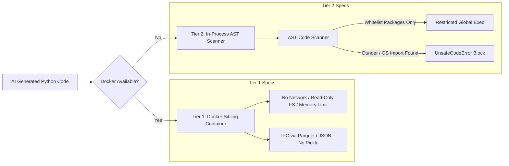
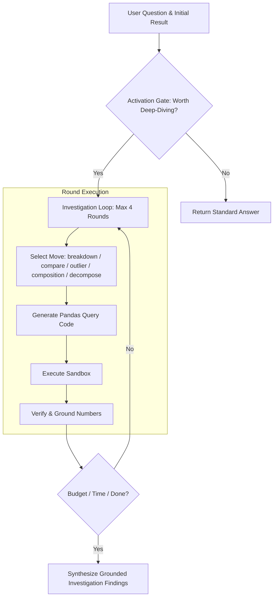
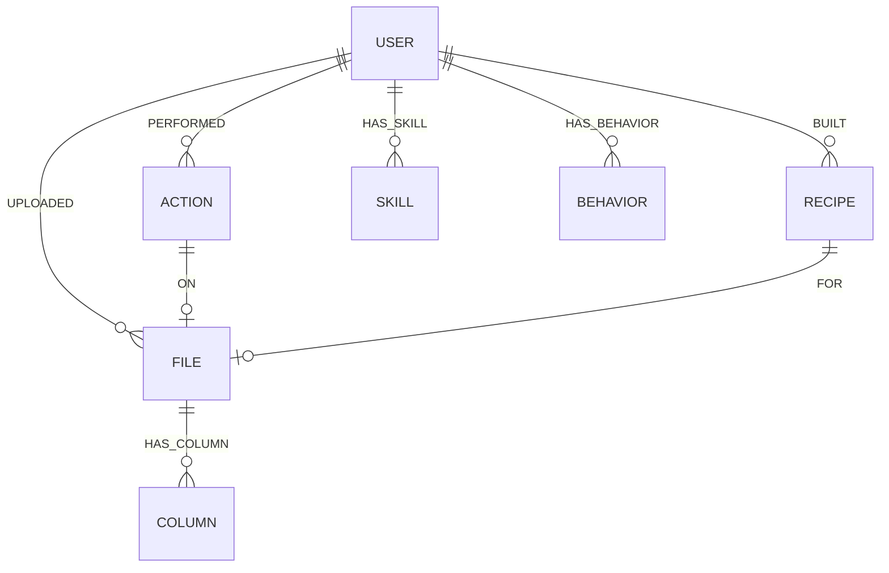

# AI Backend System Architecture Specification

## Executive Summary
This document provides a formal, modular technical specification for the AI Dashboard Tool backend. It is designed to serve as a comprehensive system prompt and architecture reference for external AI agents, developers, and infrastructure planners.

The system is designed around **Deterministic Safety, Grounded Truth Verification, Dual-Tier Execution Sandboxing, Multi-Agent Orchestration, and Graph-based Latent Memory**.

---

## 🗺️ System Overview Diagram

---

## 📦 MODULE 1: Architecture & Session State Management
**Core Files**: `app/config.py`, `app/state.py`

### 1. Key Objectives
* Prevent Out-of-Memory (OOM) failures under concurrent asynchronous requests by avoiding persistent Python object storage (raw `pandas.DataFrame`) in server RAM.
* Enforce Path Traversal security for untrusted client filenames.

### 2. Lazy Parquet Serialization (`LazySessionState`)
* **On-Set Disk Persistence**: Assigning `state["cleaned_df"]` or `state["dataframes"]` immediately serializes the Pandas DataFrames to **Apache Parquet (`.parquet`)** under `app/storage/{session_id}/dataframes/`.
* **On-Demand Deserialization**: Accessing `state["cleaned_df"]` executes a lazy read from Parquet back to a DataFrame.
* **Filename Sanitization (`_safe_filename`)**: Strips path navigation tokens (`../`, `\`, `/`) to prevent directory traversal attacks.

### 3. Environment & Graceful Degradation (`app/config.py`)
* Manages OAuth2 credentials, session secrets, and Neo4j connection parameters.
* **Graceful Degradation**: If Neo4j credentials are empty or the database is offline, graph memory operations automatically fall back to `no-op` mode without disrupting application execution.

---

## 🤖 MODULE 2: AI Routing Pool & Reliability Harness
**Core Files**: `app/ai/pool.py`, `app/ai/harness.py`

### 1. Multi-Provider AI Pool Router (`app/ai/pool.py`)
Abstracts model providers (Google Gemini, OpenAI, Local vLLM/9Router endpoints) into a managed slot pool.

* **Tier Assignment**:
  * `fast`: Schema pruning, layout formatting, color palette selection.
  * `strong`: Code generation, deep reasoning, self-correction.
* **Auto-Cooldown & Rotation**: HTTP 429 responses trigger a cooldown timer on the failed slot and rotate to the next available slot.
* **Tier Escalation**: If all `fast` slots are depleted or cooling down, requests escalate to `strong` slots.

### 2. Grounding & Verification Harness (`app/ai/harness.py`)
Guarantees absolute factual accuracy in AI outputs by verifying numbers against computed ground truth.

* **Ground Truth Collection (`collect_ground_truth`)**: Extracts numeric values directly from computed pandas outputs (KPI values, chart labels/data points, trend statistics).
* **Verification Gate (`verify_numbers`)**: Non-LLM deterministic regex scanner inspects AI-written prose. Any numeric token missing from the ground truth set is flagged as a hallucination, triggering a retry or dropping the unverifiable paragraph.
* **Task Batching (`batch_tasks`)**: Combines independent downstream tasks (Insights + Layout Selection + Skill Creation) into a single LLM invocation using partitioned JSON Schemas, reducing latency by 60–70%.

---

## ⚙️ MODULE 3: Code Interpreter & Dual-Tier Execution Sandbox
**Core Files**: `app/agent/code_interpreter.py`, `app/agent/sandbox.py`

### 1. Dual-Tier Sandbox Architecture (`app/agent/sandbox.py`)
Code generated by AI is executed in an isolated environment, never directly via `exec()` in the primary server process.

* **Tier 1 - Docker Sibling Container (Production)**:
  * Connects to Docker Daemon via `/var/run/docker.sock` to spawn an ephemeral container.
  * Enforces `network_mode="none"`, read-only filesystems (except temporary `/tmp`), 30-second execution timeouts, and resource limits.
  * Data exchange uses Parquet and JSON (Pickle is explicitly prohibited to prevent RCE).
* **Tier 2 - In-Process Restricted AST Scanner (Fallback)**:
  * Scans abstract syntax trees (`scan_code`) against a package whitelist (`pandas`, `numpy`, `math`, `re`, `datetime`, `statsmodels`).
  * Blocks dunder attributes/methods (`__subclasses__`, `__globals__`), dynamic evaluation (`eval`, `exec`), and system modules (`os`, `sys`, `subprocess`, `socket`).

### 2. Code Generation & Self-Correction Pipeline (`app/agent/code_interpreter.py`)
* **Context Pruning**: When datasets exceed 12 columns, `_prune_columns` filters out irrelevant columns using a fast LLM pass before generating the main BabelTele schema.
* **Self-Correction Loop**: Execution runtime errors (`KeyError`, `ZeroDivisionError`) are caught with full stack traces and returned to the LLM for up to 2 automated repair attempts.
* **Deterministic Layout Sanitization (`condense_layout`, `sanitize_kpis`)**: Caps time-series charts to $\le 24$ points, category charts to $\le 12$ bars, and strips invalid period comparisons.

---

## 🕵️ MODULE 4: Multi-Agent Swarm & Investigation Engine
**Core Files**: `app/agent/sub_agents.py`, `app/agent/investigator.py`, `app/agent/goal_explorer.py`, `app/agent/report.py`

### 1. Data & DataGen Sub-Agents (`app/agent/sub_agents.py`)
* **DataAgent (`run_data_agent`)**: Analyzes foreign key relationships and executes join plans (`apply_join_plan`) across multiple uploaded sheets.
* **DataGenAgent (`run_datagen_agent`)**: Synthesizes realistic mock datasets using Pandas code inside the sandbox when users submit queries without uploading files.

### 2. Bounded Investigation Engine (`app/agent/investigator.py`)
Turns static query-answering into a deep root-cause analysis loop.

* **Activation Gate (`should_investigate`)**: Determines if a query warrants root-cause analysis (e.g., "why", "root cause", abnormal delta).
* **Fixed Move Set**: Restricts round choices to `breakdown`, `compare`, `outlier`, `composition`, `decompose`, and `done`.
* **Round-Level Grounding**: Each round's output grows the cumulative ground truth set before the next round begins.

### 3. Proactive Goal Explorer (`app/agent/goal_explorer.py`)
* Triggered automatically upon file upload (before any user query).
* Uses `ThreadPoolExecutor` to concurrently run analytical hypotheses against the sandbox, returning verified initial insights ("Findings").

### 4. Executive Report Generator (`app/agent/report.py`)
* Compiles dashboard metrics into an executive narrative: **Executive Summary $\rightarrow$ Key Findings $\rightarrow$ Anomalies $\rightarrow$ Recommendations**.

---

## 📊 MODULE 5: Semantic Data Profiling & Context Assembly
**Core Files**: `app/data/semantics.py`, `app/data/context.py`, `app/agent/babeltele.py`, `app/data/profiler.py`, `app/data/merge.py`

### 1. Semantic Profiling (`app/data/semantics.py`)
Performs domain-level understanding beyond simple data types:
* **Data Grain (`grain_type`)**: Identifies row representation (`transaction_line`, `transaction`, `entity`, `snapshot`, `aggregate`).
* **Deduplication Guard (`dedup_safe`)**: Prevents false deduplication on line-item transaction tables while permitting it on dimension/entity lookup tables.
* **Domain & Caveats (`caveats`)**: Extracts units of measurement (USD, VND, kg) and structural warnings (e.g., "Do not sum snapshot stock levels across time").

### 2. BabelTele Schema Notation (`app/agent/babeltele.py`)
Compresses table metadata into shorthand notation to minimize context window consumption:
* `#`: Numeric measure column
* `$`: Category / dimension column
* `@`: Datetime column
* `∅`: Null percentage
* `D`: Distinct value count
* `[...]`: Sample values

### 3. Unified Shared Context (`app/data/context.py`)
Renders `shared_understanding()`, providing a single consistent data picture injected across Chat, Dashboard, Insights, and Executive Report prompts.

---

## 🧠 MODULE 6: Latent Graph Memory & Dynamic Skill Manager
**Core Files**: `app/memory/graph.py`, `app/agent/skills_manager.py`, `app/memory/idle_job.py`

### 1. Neo4j Graph Memory Architecture (`app/memory/graph.py`)

* **`:User` Node**: Central anchor; user properties (email, name) are stored as node attributes to prevent supernode bottlenecks.
* **`:File` Fingerprinting**: Structural column signatures (`fingerprint_profile`) allow cross-user knowledge sharing for identical file structures.
* **`:Recipe` Nodes**: Stores dashboard blueprints for replay on similar future uploads.

### 2. Idle Behavior Distillation (`app/memory/idle_job.py`)
* Asynchronous background job processes raw action logs (`:Action`) when a user goes idle, distilling them into high-level user preferences (`:Behavior`) and pruning raw logs.

### 3. Dynamic Skill Manager (`app/agent/skills_manager.py`)
* **Curated Skills (`skills/curated/`)**: Built-in, hand-tested analytical functions (Pareto, YoY growth, outlier detection).
* **Personal Learned Skills (`skills/personal/{user_id}/`)**: AI-generated Python functions auto-learned during successful chat analyses.
* **Semantic De-duplication (`_find_duplicate_skill`)**: Uses Jaccard similarity on docstrings combined with AST Operation Fingerprinting to prevent redundant skill creation.

---

## 🌐 MODULE 7: API Gateway & Routers
**Core Files**: `app/main.py`, `app/routers/chat.py`, `app/routers/upload.py`, `app/routers/agent.py`

### 1. FastAPI Gateway (`app/main.py`)
* Configures `SessionMiddleware` and `CORSMiddleware`.
* Launches background lifecycle tasks: Neo4j constraint bootstrapping and idle distillation loops.

### 2. Router Division
* **Upload Router (`app/routers/upload.py`)**: Multi-part file upload, deterministic profiling, semantic analysis, goal exploration, and join plan execution.
* **Agent Router (`app/routers/agent.py`)**: Endpoints `/run_code` (Dashboard Engine), `/generate_report` (Executive Narrative), and execution logging.
* **Chat Router (`app/routers/chat.py`)**: Endpoints `/chat` supporting Server-Sent Events (SSE) for streaming agent reasoning, text responses, and dynamic dashboard item manipulation.

---

## 📌 Summary Matrix of Backend Modules

| Module | Core Responsibility | Key Technologies / Security Controls |
| :--- | :--- | :--- |
| **Module 1: Architecture & State** | Lazy Parquet serialization & session state | Apache Parquet, Path Traversal Sanitization |
| **Module 2: AI Pool & Harness** | Multi-provider AI routing & grounding gate | Cooldown rotation, Escalation, Ground Truth Verification Gate |
| **Module 3: Code Interpreter & Sandbox** | Secure execution of AI-generated code | Dual-tier sandbox (Docker Sibling Container + AST Scanner) |
| **Module 4: Swarm & Investigation Engine** | Multi-agent orchestration & deep analysis | Bounded investigation loop, Goal Explorer, ThreadPoolExecutor |
| **Module 5: Semantic Data Profiling** | Domain understanding & schema compression | Grain determination, BabelTele compression, Shared Context |
| **Module 6: Graph Memory & Skills** | Latent memory & self-learning skills | Neo4j Graph DB, AST Operation Fingerprinting, Idle Distillation |
| **Module 7: API Gateway & Routers** | System endpoints & event streaming | FastAPI, Server-Sent Events (SSE), Asynchronous Workers |
