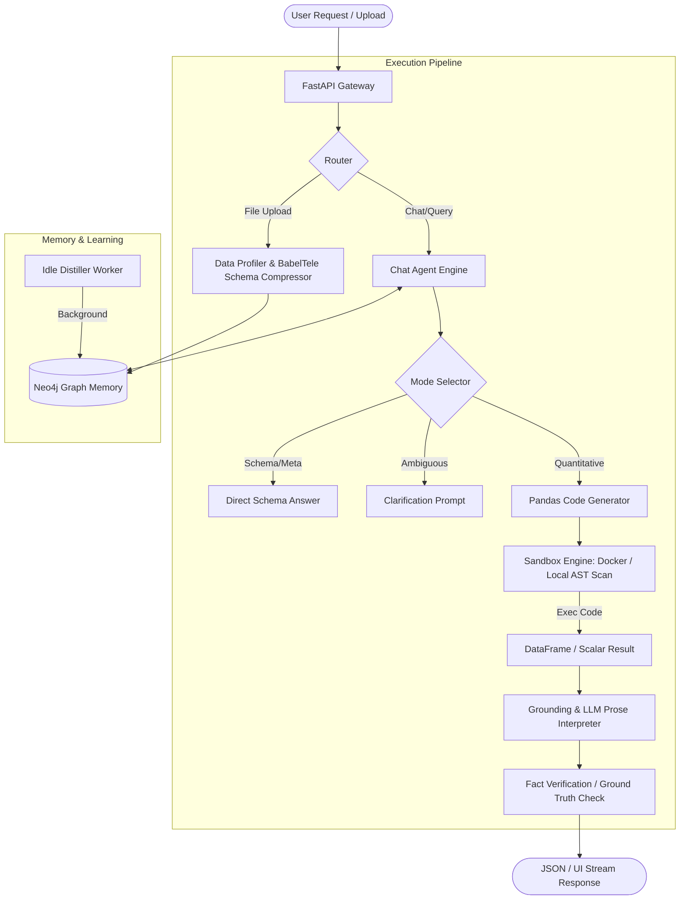

# AI Dashboard Tool & Latent Swarm Memory - Technical Specification & Architecture Report

> **System Overview**: High-performance, deterministic AI-driven Data Analytics & Dashboard Generation Platform powered by dual-layer execution (LLM Planning + Python Code Sandbox), Graph Memory (Neo4j), and Latent Swarm Telemetry.

---

## 1. Core Architecture & Philosophy

The system separates **reasoning/planning** from **numerical computation**:
- **LLM Role**: Intent recognition, schema analysis, code snippet generation (Pandas/Python), and natural language interpretation.
- **Deterministic Execution**: LLMs **NEVER** calculate or guess numbers directly. All quantitative metrics, aggregations, and charts are derived by running generated Python code inside an isolated **Code Sandbox**.
- **Fact Verification Gate (Ground Truth)**: Output prose is verified against computed outputs to prevent hallucinations.



---

## 2. Component Specifications

### 2.1 File Ingestion & BabelTele Compression
- **Goal**: Support massive tabular files without exhausting LLM context windows.
- **BabelTele Format**: A compressed notation for dataframe schema representation:
  - `T`: Table Name, `R`: Row Count
  - `#`: Numeric Column, `$`: Category/Dimension, `@`: Datetime
  - `∅`: Null Percentage, `Σ`: Sum, `μ`: Mean
- **Schema Protection**: Column statistics can be truncated under token budget limits, but exact column names are never omitted to prevent LLM `KeyError` exceptions.

### 2.2 Dual-Tier Sandbox Execution (`app/agent/sandbox.py`)
- **Tier 1 (Production Docker Sibling Container)**:
  - Network-disabled (`network_mode="none"`), limited memory (512MB RAM), CPU capped (1 vCPU).
  - Data payload transfers via **Parquet + JSON** (strictly prohibiting Pickle to prevent RCE).
- **Tier 2 (Fallback Local Execution)**:
  - Static AST scanning (`ast.parse`) checking for forbidden dunder attributes (`__import__`, `eval`, `exec`) and blacklisted modules (`os`, `sys`, `subprocess`).
  - Restricted namespace execution with strict timeout handlers.

### 2.3 Decision & Execution Flow (`app/agent/chat_agent.py`)
1. **Decision Stage**:
   - `mode = "answer"`: Meta questions answered directly from schema.
   - `mode = "code"`: Writes Pandas Python script setting output to `result`.
   - `mode = "clarify"`: Asks a targeted clarifying question with clickable option buttons if ambiguous.
2. **Self-Correction Loop**:
   - If Pandas execution fails (e.g., `KeyError`), traceback error log is injected back into the LLM context for up to 2 retries.
3. **Grounding & Interpretation**:
   - LLM formats computed results into Vietnamese prose.
   - Numbers in output prose are cross-referenced with `ground_truth` extracted from pandas outputs. Discrepancies trigger a re-write step.

### 2.4 Graph Memory & Latent Swarm (`app/memory/graph.py` & `idle_job.py`)
- **Neo4j Storage**: Stores entities (`:User`, `:Action`, `:Behavior`, `:Workspace`).
- **User Profiling**: User preferences (e.g., "always prefers pie charts", "groups revenue by week") are injected into the Chat Agent prompt as `[MEMORY BLOCK]`.
- **Idle Distiller**: Background thread distills user `Action` buffer into long-term `Behavior` nodes during system idle states.

---

## 3. Data Flow & Interface Formats

### 3.1 Decision Schema (JSON Output from LLM)
```json
{
  "mode": "code | answer | clarify",
  "reason": "Short rationale for choice",
  "code": "result = df.groupby('Category')['Revenue'].sum().reset_index()",
  "clarify_question": "Bạn muốn tính doanh thu theo Chi nhánh hay Vùng?",
  "clarify_options": ["Theo Chi nhánh", "Theo Vùng"],
  "used_memory_ids": ["mem_01"]
}
```

### 3.2 Interpretation Schema
```json
{
  "answer": "Tổng doanh thu đạt 1,250,000,000 VNĐ.",
  "chart": {
    "type": "bar | line | pie | vega",
    "title": "Doanh thu theo Vùng",
    "labels": ["Miền Bắc", "Miền Nam"],
    "values": [750000000, 500000000],
    "vegaLiteSpec": {}
  },
  "follow_up": ["Phân tích thêm chi phí của Miền Bắc?"]
}
```

---

## 4. Key Security & Reliability Guards
1. **Zero Hallucination Numbers**: LLMs are prohibited from generating direct quantitative values without Pandas sandbox execution.
2. **Container Security**: Zero network egress, hard CPU/RAM caps, non-pickle IPC.
3. **AST Safety Guard**: Static code inspection preventing code injection or container escape.
